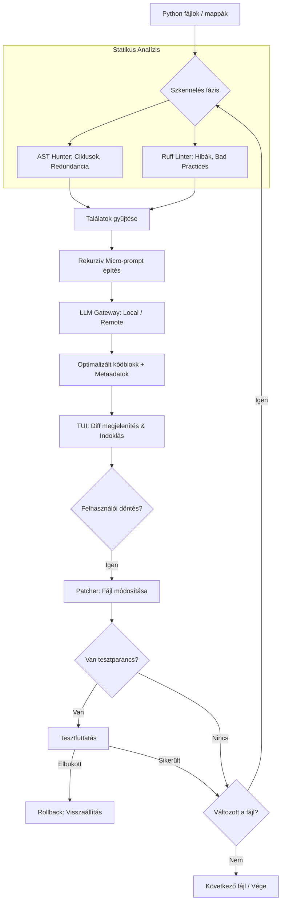

# 🚀 OptiCode: Enterprise & CI/CD Edition

Az **OptiCode** egy intelligens, hibrid kódoptimalizáló, amely egyesíti a statikus analízist és az LLM erejét.

## 🛠️ Főbb Funkciók
- **Hibrid Elemzés:** AST Hunter + Ruff Linter.
- **CI Pipeline Mód (`--ci`):** Teljesen automatizált, teszt-vezérelt optimalizálás emberi beavatkozás nélkül.
- **Git Workflow Integráció:** Automatikus ágkezelés és commit minden változtatás után.
- **Intelligens Caching:** Helyi gyorstárazás a költségek csökkentésére.
- **Automatikus Verifikáció & Rollback:** Azonnali visszaállítás hibás optimalizálás esetén.
- **PEP8 Import Normalization:** Automatikus import rendezés a fájlok tetejére.

---

## 🏗️ Hogyan működik? (Architektúra)



---

## 🚀 Használat

### Pipeline-ban (CI/CD):
A `--ci` módhoz kötelező megadni egy tesztparancsot. Ha a tesztek elbuknak, az OptiCode automatikusan visszavonja a hibás változtatást.
```bash
python cli.py . --ci --test-cmd "pytest"
```

### Interaktív módban:
Végigvezet a változtatásokon, diffet mutat és jóváhagyást kér.
```bash
python cli.py main.py --test-cmd "python tests.py"
```

### Paraméterek:
- `path`: Mappa vagy fájl elérési útja.
- `--ci`: Pipeline mód (nincs diff, nincs prompt, kötelező a `--test-cmd`).
- `--test-cmd`: A verifikációhoz használt parancs.
- `--git-branch`: Új git ág és commitok minden módosításhoz.
- `--allow-edit` / `-y`: Automatikus javítás (interaktív módban is).
- `--allow-remote`: Remote LLM fallback engedélyezése.
- `--remote-model`: Remote LLM modell az eskalációhoz.
- `--max-remote-file-percent`: Fájlonként max. küldhető kód százalék.
- `--recursive-max-steps`: Rekurzív próbálkozások száma a kis modellen.
- `--decision-models`: Vesszővel elválasztott döntési modellek (rerank/verify).
- `--no-cache`: Optimalizációs cache kikapcsolása (teszteléshez ajánlott).
- `--rollback-on-fail`: Automatikus rollback teszthiba esetén.
- `--repair-mode`: Teszt-hiba esetén teljes fájlos javítási próbálkozás (repair pipeline).
- `--safe-only`: Csak determinisztikus, biztonságos optimalizálások futtatása.
- `--micro-steps`: Rekurzív micro-lépések száma snippetenként (kicsi modellekhez).
- `--max-slice-lines`: Max sorok száma LLM-nek küldött snippetben.
- `--debug-matches`: Részletes találat/skip log a diagnosztikához (alapból is listázza a match-ek számát).
- `--retrieval-top-k`: Heurisztikus top-k rule jelöltek (RAG-szerű előszűrés).
- A futtatás végén külön statisztikák jelennek meg a no-op, kihagyott szabályok és rollback esetekről.

---

## ⚙️ Telepítés
```bash
pip install -r requirements.txt
pip install ruff
```

---

## 📊 Statisztikák
A futtatás végén az OptiCode egy összefoglaló táblázatot mutat a felhasznált tokenekről és a becsült költségről.

---

## 🔧 Copilot modellek konfigurálása
Alapból fix Copilot modell lista van, de felülírható környezeti változóval:

```bash
export COPILOT_MODELS="copilot/gpt-4o,copilot/claude-3.5-sonnet,copilot/gpt-5.2-codex"
```

Ezután a CLI ebből a listából kínál választást.
