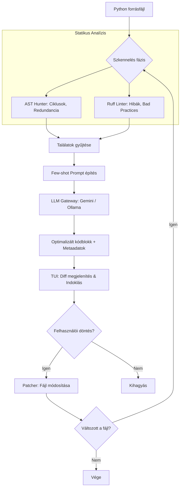

# 🚀 OptiCode: Hybrid (AST + Static + LLM) Code Optimizer

Az **OptiCode** egy intelligens parancssori eszköz, amely a determinisztikus kódelemzést ötvözi a generatív mesterséges intelligencia (LLM) erejével. Nemcsak megtalálja a teljesítménybeli szűk keresztmetszeteket, hanem javítási javaslatokat is tesz, indoklással és becsült gyorsulással kiegészítve.

## 🛠️ Főbb jellemzők
- **Hibrid elemzés:** AST-alapú mintakeresés + Ruff statikus analízis.
- **Redundancia-vadászat:** Ciklus-invariáns kifejezések automatikus felismerése.
- **Multi-pass (Iteratív) optimalizálás:** Addig finomítja a kódot, amíg van javítási lehetőség (max. 3 kör).
- **Token-takarékos:** Csak az érintett kódrészleteket küldi az LLM-nek.
- **Biztonságos:** Interaktív diff-alapú jóváhagyás minden módosítás előtt.
- **Részletes elemzés:** Minden javításhoz kapsz fókuszt (pl. Cache Locality) és becsült gyorsulást (pl. 5x).

---

## 🏗️ Hogyan működik? (Architektúra)



---

## ⚙️ Beállítás és Telepítés

### 1. Függőségek telepítése
Győződj meg róla, hogy a virtuális környezetedben vagy, majd:
```bash
pip install -r requirements.txt
```

### 2. Környezeti változók (.env)
Hozz létre egy `.env` fájlt a projekt gyökerében:
```env
# Alapértelmezett LLM szolgáltató (LiteLLM formátum)
OPTIMIZER_LLM_PROVIDER=gemini/gemini-1.5-flash
GEMINI_API_KEY=a_te_api_kulcsod

# Opcionális: Lokális modellek Ollama-val
# OPTIMIZER_LLM_PROVIDER=ollama/llama3:8b
```

---

## 🚀 Használat

### Alapértelmezett interaktív mód:
Ez a mód végigvezet a találatokon, és minden módosításnál rákérdez a jóváhagyásra.
```bash
python cli.py test_sample.py
```

### Automatikus mód (pl. CI/CD-hez):
```bash
python cli.py src/main.py --allow-edit --skip-linter
```

### Paraméterek:
- `--allow-edit` / `-y`: Automatikusan elfogad minden javítást.
- `--focus` / `-f`: Csak egy bizonyos szabályra koncentrál (pl. `list_comprehension`).
- `--max-passes`: Maximális iterációk száma (alapértelmezett: 3).
- `--skip-linter`: Kihagyja a Ruff statikus analízist.

---

## 📁 Projektstruktúra
- `cli.py`: A parancssori interfész és az iteratív vezérlés.
- `hunter.py`: AST-alapú mintakereső (Hunter).
- `linter.py`: Ruff linter integráció.
- `optimizer.py`: LLM gateway és prompt management.
- `patcher.py`: Kód beillesztése és diff megjelenítése.
- `rules.yaml`: A szabálykönyv és a few-shot példák.
