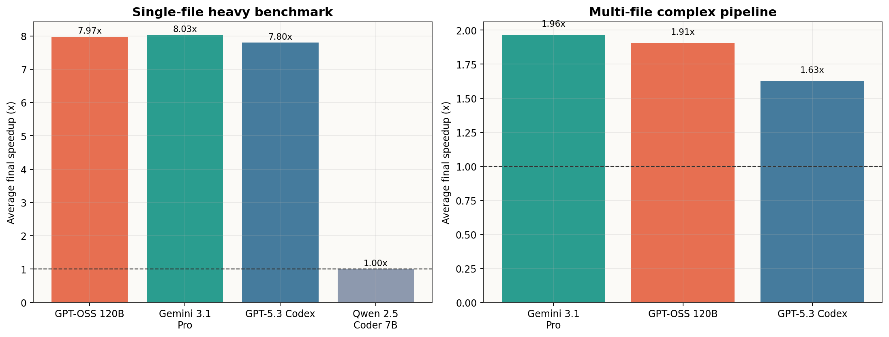
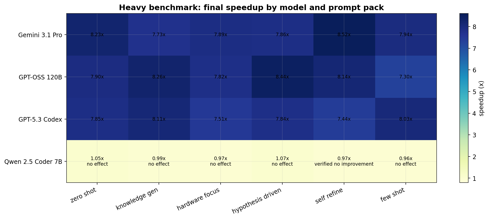
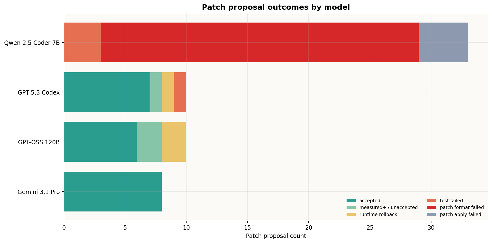

# 3. Automatikus kódoptimalizálás

**Feladat azonosítója és címe:** 3. Automatikus kódoptimalizálás  
**Beadó:** Bence Gyurus  
**Git repository:** [https://github.com/BenceGyurus/code-optimizer](https://github.com/BenceGyurus/code-optimizer)

Ennél a feladatnál azt szerettem volna kipróbálni, hogy mennyire lehet LLM-eket nem csak egyszerű kódgenerálásra használni, hanem egy kontrolláltabb optimalizálási folyamat részeként. A lényeg az volt, hogy a modell ne csak ránézésre írjon át valamit, hanem előtte mérjen, nézze meg a kódot, válasszon egy konkrét célpontot, készítsen patch-et, majd a program tesztekkel és újraméréssel ellenőrizze, hogy tényleg jobb lett-e. Így a modell nem önállóan dönt arról, hogy sikerült-e az optimalizálás, hanem a program csak akkor fogadja el a változtatást, ha a kód továbbra is helyes és mérhetően gyorsabb.

A megoldás közben két fő futtatási mód készült. Az `optimizer run` egyetlen optimalizálási sessiont futtat, az `optimizer evaluate` pedig több modellből, prompt pack-ből és ismétlésből álló mérést tud elvégezni. Nekem a második volt a fontosabb, mert így össze lehetett hasonlítani különböző modelleket és promptolási stratégiákat. A futások végén a program külön mappákba menti az egyes sessionöket, készít `CSV` és `YAML` eredményeket, Markdown riportot és diagramokat is. A benchmark és a hardveres mérés nem egyetlen futásból jön ki, hanem több ismétlés átlagából, például a végső méréseknél 15 futásból.

Fontos része volt a megoldásnak az is, hogy a modell ne tudjon végtelenségig futni. Ezt úgy oldottam meg, hogy a programban van egy állapotgép, és minden állapotban csak bizonyos toolokat lehet meghívni. Például baseline mérés előtt nem lehet patch-et alkalmazni, patch után pedig kötelező a verifikáció. Emellett minden session kap felső korlátot az LLM hívásokra, tool hívásokra és iterációkra (`--max-llm-calls`, `--max-tool-calls`, `--max-iterations`). Erre azért volt szükség, mert a korai futásoknál volt olyan modell, ami ugyanazt az inspect vagy propose lépést kérte újra és újra, illetve volt olyan is, amelyik hibás JSON-t adott vissza. Ilyenkor a guardrail megállítja a folyamatot, rollbackel, vagy `DONE`/`FAILED` állapotba viszi a sessiont.

## A rendszer fő eszközei

| Tool | Mire való |
| --- | --- |
| `inspect_codebase` | A modell kontextust kap a projektről, a fájlokról és a releváns kódrészletekről. |
| `run_baseline` | Lefuttatja az alap teszteket, a benchmarkot és a hardveres méréseket. |
| `profile_execution` | cProfile és Linuxon `perf` alapján megmutatja, hogy hol megy el az idő. |
| `analyze_candidate` | A modell kiválasztja, melyik függvényt vagy fájlt érdemes optimalizálni. |
| `propose_change` | A modell patch-et javasol a kiválasztott célpontra. |
| `apply_and_verify` | A program alkalmazza a patch-et, majd lefuttatja a teszteket. |
| `remeasure` | Újraméri az optimalizált kódot, hogy össze lehessen hasonlítani a baseline-nal. |
| `evaluate_result` | Eldönti, hogy az eredmény elfogadható-e, vagy nem érdemes tovább próbálkozni. |
| `rollback_to_checkpoint` | Hibás vagy lassabb módosításnál visszaállítja a biztonságos állapotot. |

A projektben több promptolási stratégia is található a `prompts/` mappában. Ezek mind ugyanazt az optimalizáló programot használják, csak más módon próbálják rávezetni a modellt a jó döntésre. A `zero_shot` minimális instrukcióval dolgozik, a `few_shot` példák alapján mutatja meg a várt működést, a `knowledge_gen` előbb háttértudást és hipotézist épít, a `hardware_focus` a cache és branch jellegű mérésekre figyel jobban, a `self_refine` saját ellenőrzésre kéri a modellt, a `cot` és a `least_to_most` lépésenkénti gondolkodást használ, a `prompt_chaining` pedig jobban szétválasztja a döntési lépéseket. Ezek mellett szerepel az `agentic` és a `hypothesis_driven` is, ahol már erősebben megjelenik az, hogy a modellnek a program állapotához és a mérési eredményekhez kell igazodnia.

## Kiemelt prompt pack: `hypothesis_driven`

A mérések alapján a `hypothesis_driven` volt az egyik legjobban védhető prompt pack, ezért ezt választottam ki részletesebben. Ennek az a lényege, hogy a modell ne általános optimalizálási ötleteket adjon, hanem mindig fogalmazzon meg egy mérhető hipotézist. Tehát mondja meg, hogy melyik metrikának kell javulnia, miért pont az adott kódrészletet választja, és a patch miért fog ezen segíteni. Ez szerintem jól illik ehhez a programhoz, mert itt amúgy is minden döntés méréshez van kötve.

| Prompt fájl | Mire való |
| --- | --- |
| `master.md` | Beállítja a modell szerepét, az állapotgépet, az engedélyezett actionöket és azt, hogy mérés alapján kell dolgoznia. |
| `decision.md` | Minden lépésnél kiválasztja a következő toolt, de csak érvényes JSON választ adhat. |
| `analyze_candidate.md` | Kiválaszt egy konkrét hotspotot, és ehhez mérhető hipotézist kell adnia. |
| `propose_change.md` | Patch-et kér a célpontra, rövid indoklással és várható hatással. |
| `evaluate_result.md` | Összeveti az elvárt és a mért eredményt, majd eldönti, hogy meg kell-e állni. |
| `config.yaml` | A prompt pack neve, verziója és rövid leírása. |

## Eredmények

A végső teszteknél kétféle kódot használtam. Az `examples/heavy_compute.py` egy egyfájlos, direkt számításigényes példa volt, ahol jól látszott, hogy a modellek megtalálják-e a domináns algoritmikus hibát. Itt a legerősebb modellek szinte mindig a `segmented_prefix_sums_slow` részt találták meg, és az O(n²) jellegű számítást O(n) futó összeges megoldásra cserélték. Emiatt több modellnél is 7-8x körüli gyorsulás jött ki, ami elsőre furcsának tűnhet, de valójában azt mutatja, hogy ebben a kódban volt egy nagyon erős, egyértelmű hotspot.







A második méréshez készítettem egy többfájlos `examples/complex_pipeline` példát is. Ez már nehezebb volt, mert több fájl, több wrapper függvény és több kisebb hotspot volt benne. Itt jobban kijött, hogy nem elég csak a legnagyobb kumulatív futásidőt nézni, mert az néha csak azt mutatja, hogy melyik magasabb szintű függvény hív sok másikat. A jobb optimalizációhoz a tényleges self-time hotspotot kellett megtalálni, például a `customer_recent_totals` jellegű részeket.

A modellek viselkedése alapján az derült ki, hogy a nagyobb modellek előnye nem feltétlenül az volt, hogy teljesen más ötletet találtak, hanem az, hogy stabilabban vitték végig ugyanazt a jó mérnöki döntést. A Gemini 3.1 Pro, a GPT-OSS 120B és a GPT-5.3 Codex jól működtek a rendszerrel, a self-hostolt Qwen 2.5 Coder 7B viszont sokszor közel volt a jó irányhoz, de a patch formátuma vagy a kód szemantikája nem volt elég stabil. Ez hasznos tapasztalat volt, mert így látszott, hogy egy lokális vagy olcsóbb modell nem biztos, hogy a teljes folyamatban is olcsóbb, ha sok sikertelen próbálkozást termel.

## Futtatás

Fejlesztés közben a CLI telepítés nélkül is futtatható:

```bash
PYTHONPATH=src .venv/bin/python -m optimizer.cli doctor
```

Egy olcsó smoke teszt Debianon:

```bash
OPENROUTER_API_KEY=sk-or-... ./scripts/evaluate_debian_smoke.sh examples/complex_pipeline results/debian-smoke-complex
```

A komplex, többfájlos végső futás:

```bash
OPENROUTER_API_KEY=sk-or-... RUN_REPETITIONS=15 ./scripts/evaluate_debian_complex.sh
```

## Tanulságok

A legfontosabb technikai tanulság nekem az volt, hogy az AI-alapú kódoptimalizálás akkor kezd igazán használható lenni, ha nem csak promptolásból áll. A modell önmagában tud mondani jó ötletet, de ettől még nem biztos, hogy a kód helyes marad, vagy hogy tényleg gyorsabb lesz. Emiatt kellett köré mérés, tesztelés, rollback és újramérés. Így a modell javasol, de a program dönt arról, hogy a javaslat elfogadható-e.

Az is látszott, hogy a modellek összehasonlításánál nem csak a végső speedup számít. Egy egyszerűbb benchmarkon több modell is ugyanarra a 7-8x gyorsításra jutott, mert a legnagyobb hiba nagyon egyértelmű volt. Ilyenkor a különbség inkább abban jelenik meg, hogy mennyire kevés hibás JSON-t adnak, mennyire jó patch-et készítenek, és mennyire tartják be az állapotgép szabályait. Tehát nem csak az a kérdés, hogy "megtalálta-e az ötletet", hanem az is, hogy végig tudta-e vinni úgy, hogy a rendszer elfogadja.

A promptstratégiáknál az volt a tanulság, hogy azok működtek jobban, amelyek illeszkedtek a program működéséhez. A `hypothesis_driven` azért volt jó, mert ugyanarra kényszerítette a modellt, amit a rendszer is elvárt: mérhető állítás, konkrét célpont, ellenőrzött patch és döntés az eredmény alapján. Egy nagyon egyszerű esetben a `zero_shot` is tud jó lenni, de többfájlos vagy bizonytalanabb projektnél sokkal fontosabb, hogy a prompt ne csak általános instrukció legyen, hanem a program tooljait és állapotait is értse a modell.

A hardveres méréseknél külön érdekes volt, hogy a cache hit-rate önmagában nem mindig jó sikerességi mutató. Volt olyan futás, ahol a cache arány kicsit romlott, de a program mégis sokkal gyorsabb lett, mert egyszerűen sokkal kevesebb munkát végzett. Emiatt a runtime lett az elsődleges metrika, a cache, L1, branch és LLC adatok pedig inkább magyarázó metrikák. Az LLC counterekkel az is kiderült, hogy Linuxon sem garantált, hogy minden hardveres számláló elérhető, ez függ a géptől, kerneltől és virtualizációtól is.

A többfájlos példánál az volt a legfontosabb, hogy a profilozási eredményeket nem szabad vakon olvasni. A cProfile kumulatív ideje néha olyan függvényre mutat, ami csak meghív sok másik drága részt, de nem ott érdemes optimalizálni. Ilyenkor a modellnek és a programnak is jobb kontextus kell: fájlok közötti kapcsolat, self-time, hívási lánc és célzott kódrészlet. Ezért került bele később az is, hogy nagyobb projektnél ne egyben kapja meg az egész kódot, hanem a program logika alapján tördelje és célzottabban adja oda a kontextust.

Összességében szerintem a feladat lényege az lett, hogy az AI nem egy varázslatos optimalizáló, hanem egy mérnöki folyamat egyik eleme. A jó eredményt nem csak a modell adja, hanem az, hogy van körülötte mérés, guardrail, teszt, rollback, budget és riportolás. Így már nem csak az látszik, hogy "az AI átírt valamit", hanem az is, hogy mit változtatott, miért, hányszor próbálkozott, sikeres volt-e, és mérhetően mennyit javult tőle a program.

Részletesebb elemzés és további diagramok: [docs/experiments/debian-combined-llm-prompt-analysis/README.md](docs/experiments/debian-combined-llm-prompt-analysis/README.md)

Technikai használati útmutató a CLI-hez és a régi részletesebb architekturális leíráshoz: [USERMANUAL.md](USERMANUAL.md)

## Ellenőrzés

```bash
PYTHONPATH=src .venv/bin/python -m compileall -q src/optimizer
PYTHONPATH=src .venv/bin/python -m pytest -q
PYTHONPATH=src .venv/bin/python -m optimizer.cli doctor
```
