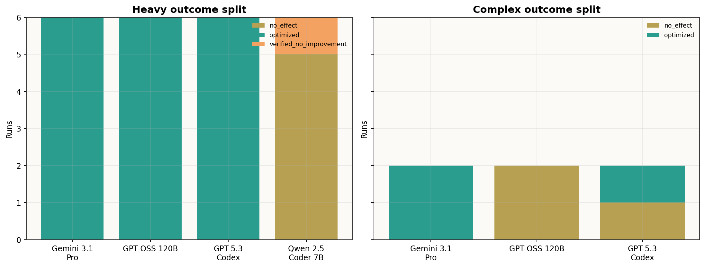
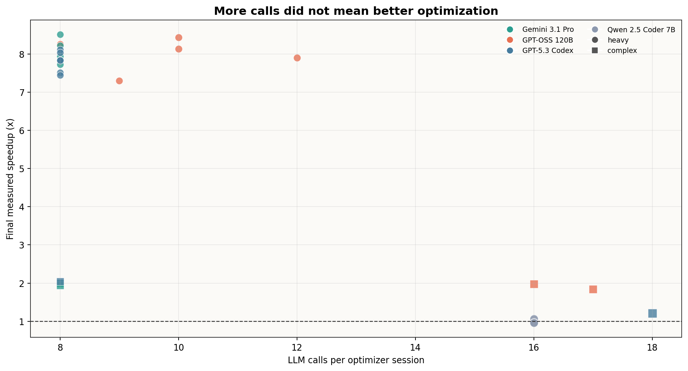
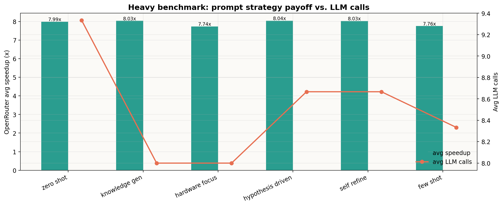
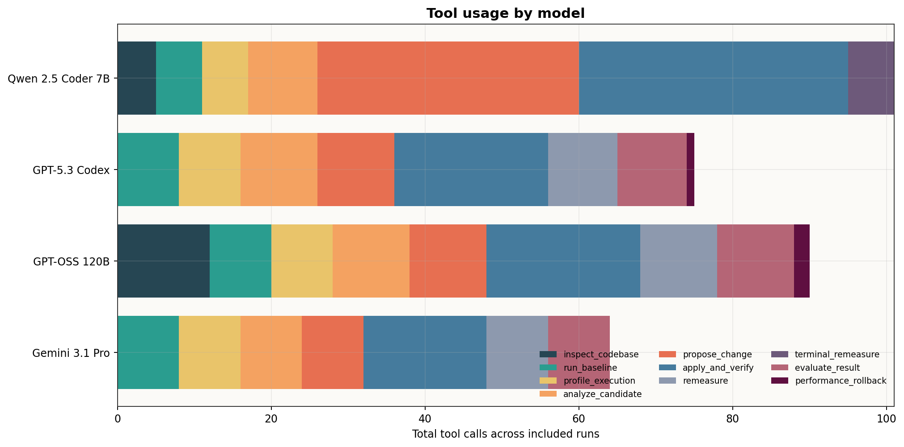
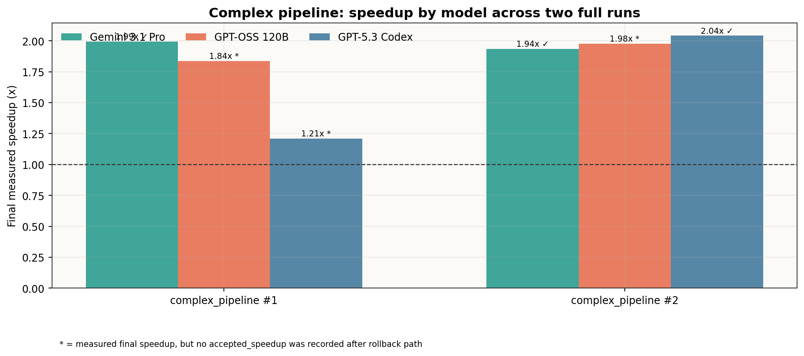
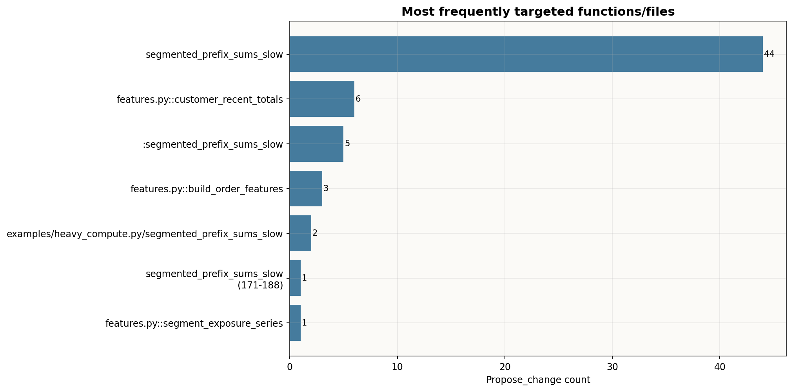
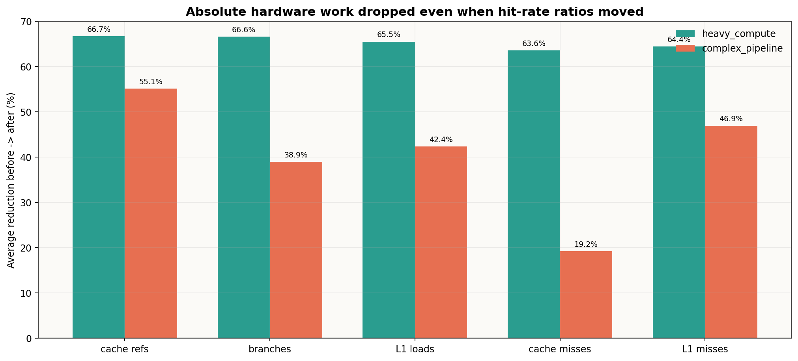

# Kombinált LLM- és promptstratégia-elemzés

Ez a dokumentum a csatolt `debian-full-heavy` és `debian-complex-pipeline` eredmények teljes aggregált adataiból készült. Nem csak a fő riportokat nézi: felhasználja az `aggregated_results.csv` mezőit, a sessionenkénti `tool_output_*.json` fájlokat, a patch-javaslatokat, a rollbackeket, a verifikációs hibákat, a cProfile hotspotokat és a `perf` hardveres összefoglalókat is.

## Vezetői összefoglaló

- Összesen **30 teljes optimizer session** került be az elemzésbe: **24** a single-file `heavy_compute.py` benchmarkból és **6** a többfájlos `complex_pipeline` benchmarkból.
- Minden mérési pont **15 ismétlés átlagából** készült. A feldolgozott session logok alapján legalább **930 unittest ismétlés**, **855 benchmark futás** és **405 perf/profile futás** szerepel az adathalmazban.
- A `heavy_compute.py` feladaton a három OpenRouter modell **18/18** futásban sikeresen optimalizált, átlagosan **7.93x** gyorsulással.
- A self-hostolt `qwen2.5-coder:7b` ugyanazon heavy feladaton **0/6** sikeres optimalizálást ért el; a célpontot gyakran megtalálta, de a patch formátuma vagy szemantikája nem volt stabil.
- A többfájlos komplex pipeline-on a végső mért gyorsulás modellfüggően **1.21x - 2.04x** között mozgott. Ez jóval nehezebb, reálisabb feladat volt: több hotspot, több visszagörgetés és több célpontválasztási hiba jelent meg.
- A közös tanulság: az AI akkor hozott valódi értéket, amikor a profilingból kiválasztotta a magas **self-time** célfüggvényt, és algoritmikus változtatást csinált. Wrapper vagy aggregáló függvény mikrotuningja többnyire kevésbé volt hasznos, néha regressziót okozott.

## Felhasznált futások

| Eval címke | Dataset | Forrás | Sessionök |
| --- | --- | --- | --- |
| heavy_compute | `heavy_compute` | `results/debian-full-heavy/eval_1778099536167691431_cc85116f` | 24 |
| complex_pipeline #1 | `complex_pipeline` | `results/debian-complex-pipeline/eval_1778143875045946832_ffd73e13` | 3 |
| complex_pipeline #2 | `complex_pipeline` | `results/debian-complex-pipeline/eval_1778146955398724140_6817e687` | 3 |
| kizárva | `incomplete` | `results/debian-full-heavy/eval_1778096075249630289_47d06ccc` | nincs aggregated CSV/YAML |

A kizárt `debian-full-heavy/eval_177809607...` könyvtárban nem volt `aggregated_results.csv` és `aggregated_results.yaml`, ezért nem kevertem bele az átlagokba. Ez fontos, mert különben félkész sessionök torzíthatnák a következtetést.

## Összesített kép

| Dataset | Session | Optimized | Nem optimized | Átlag baseline | Átlag final | Átlag speedup | Átlag LLM call | Átlag tool call |
| --- | --- | --- | --- | --- | --- | --- | --- | --- |
| heavy_compute | 24 | 18 | 6 | 4.882 s | 1.687 s | 6.20x | 10.4 | 10.2 |
| complex_pipeline | 6 | 3 | 3 | 1.749 s | 0.985 s | 1.83x | 12.5 | 12.5 |

A single-file heavy benchmark látványosan demonstrációbarát: van benne egy domináns, kvadratikus hotspot. Emiatt a nagy modellek nagyon hasonló, közel 8x gyorsulást értek el. A komplex pipeline már jobban szétválasztja a modelleket, mert ott több fájlban, több egymást hívó függvény között kellett megtalálni a ténylegesen javítható pontot.

## Modell szerinti viselkedés

| Modell | Session | Optimized | Átlag speedup | Átlag baseline | Átlag final | Átlag LLM | Átlag tool | Patch apply hiba | Teszt/verifikációs hiba | Performance rollback |
| --- | --- | --- | --- | --- | --- | --- | --- | --- | --- | --- |
| Gemini 3.1 Pro | 8 | 8 | 6.51x | 4.119 s | 0.679 s | 8.0 | 8.0 | 0 | 0 | 0 |
| GPT-OSS 120B | 8 | 6 | 6.46x | 4.110 s | 0.689 s | 11.2 | 11.0 | 0 | 0 | 2 |
| GPT-5.3 Codex | 8 | 7 | 6.25x | 4.055 s | 0.756 s | 9.2 | 9.2 | 0 | 1 | 1 |
| Qwen 2.5 Coder 7B | 6 | 0 | 1.00x | 4.896 s | 4.902 s | 16.0 | 15.8 | 27 | 3 | 0 |

### Gemini 3.1 Pro Preview

A Gemini volt a legkiegyensúlyozottabb a kombinált eredmények alapján. A heavy benchmarkon minden prompt packkel sikeresen optimalizált, a komplex pipeline mindkét futásában elsőre jó célpontot választott, és nem kellett rollback. A komplex pipeline-on mindkét alkalommal `customer_recent_totals` jellegű, algoritmikus sliding-window optimalizációra jutott, ami kb. 1.94-1.99x gyorsulást adott.

### GPT-OSS 120B

A GPT-OSS 120B a heavy benchmarkon nagyon erős volt: minden prompt packkel sikeres, átlagosan közel 8x gyorsulással. A komplex pipeline-on viszont látszik a nehezebb feladat: mindkét futásban először a `build_order_features` wrapper/aggregáló függvényt próbálta gyorsítani, ami runtime regressziót okozott és rollbackre került. Ezután a `customer_recent_totals` célponttal már ténylegesen gyorsult a final runtime. A riportban ezek `no_effect` kimenetként szerepelnek, mert a rollbackes útvonal után nem keletkezett `accepted_speedup`, de a final mért runtime így is kb. 1.84-1.98x gyorsulást mutatott. Ezt érdemes a dolgozatban külön megmagyarázni.

### GPT-5.3 Codex

A GPT-5.3 Codex a heavy benchmarkon tiszta, rövid, hibamentes futásokat adott: 6/6 optimized, jellemzően 8 LLM és 8 tool hívással. A komplex pipeline-on vegyesebb volt: az egyik futásban elsőre elfogadott, kb. 2.04x gyorsulást adott, a másikban volt egy verifikációs hiba, egy runtime rollback, majd egy kisebb, 1.21x final javulás. Ez azt mutatja, hogy a többfájlos, kevésbé egyértelmű kontextusban már nem elég a jó kódolási képesség; a célpontválasztás legalább ilyen fontos.

### Qwen 2.5 Coder 7B Ollamán

A Qwen eredménye hasznos negatív kontroll. Többször felismerte a `segmented_prefix_sums_slow` irányt, tehát a problémaérzékelés nem volt teljesen rossz. A gond a patch-előállítás volt: sok patch nem a rendszer által elfogadott `*** Update File:` formátumban érkezett, vagy szemantikailag nem ment át a teszteken. Emiatt a modell elérte a magas LLM/tool call számot, de nem adott elfogadott optimalizációt. Lokális, olcsó smoke-runra jó, végső összehasonlításra ebben a feladatban nem bizonyult elég megbízhatónak.

## Promptstratégia-elemzés

A prompt pack-eket fair módon főleg a heavy benchmark OpenRouter részén lehet összehasonlítani, mert ott minden prompt minden nagy modellen egyszer lefutott. A komplex pipeline-ban direkt már csak a legígéretesebb `hypothesis_driven` pack futott.

| Prompt pack | OpenRouter heavy session | Sikerarány | Átlag speedup | Átlag LLM call | Átlag tool call |
| --- | --- | --- | --- | --- | --- |
| `zero_shot` | 3 | 3/3 | 7.99x | 9.3 | 8.7 |
| `knowledge_gen` | 3 | 3/3 | 8.03x | 8.0 | 8.0 |
| `hardware_focus` | 3 | 3/3 | 7.74x | 8.0 | 8.0 |
| `hypothesis_driven` | 3 | 3/3 | 8.04x | 8.7 | 8.7 |
| `self_refine` | 3 | 3/3 | 8.03x | 8.7 | 8.7 |
| `few_shot` | 3 | 3/3 | 7.76x | 8.3 | 8.3 |

A heavy benchmarkon a promptstratégiák közti különbség kisebb, mint a modellek közti különbség, mert a fő hotspot nagyon domináns volt. Ettől még látszik egy mintázat: a `hypothesis_driven`, `knowledge_gen` és `self_refine` illeszkedik legjobban a program mérésvezérelt természetéhez. Ezek explicit módon összekötik a profilingot, a hipotézist, a patch indoklását és a visszamérést. A `hardware_focus` nem lett rossz, de itt a fő nyereség algoritmikus volt, nem cache-locality mikrotuning.

## Tool-használat

A nagy modellek jellemzően a minimális állapotgép-utat követték: baseline, profiling, analyze, propose, apply, verify, remeasure, evaluate. A Qwen ezzel szemben sok `propose_change` és `apply_and_verify` kört fogyasztott el úgy, hogy a patch formátum vagy a tesztelés elakadt. A komplex pipeline-on a rollbackes útvonalak miatt a GPT-OSS és a GPT-5.3 Codex tool-használata megugrott, ami jól mutatja, hogy a többfájlos, több hotspotú feladatban a rendszer guardrailjei ténylegesen dolgoztak.

LLM-válaszformátum szempontból is stabil maradt a futás: a session logokban 2 nyers `llm_parse_error_*.json` fájl jelent meg, és az aggregált CSV egy további GPT-OSS recoveryt jelölt a komplex pipeline első futásában. Ezek egyike sem vitte `FAILED` állapotba a teljes sessiont. Ez fontos tapasztalat, mert a rendszer nem csak akkor használható, ha a modell mindig tökéletes JSON-t ad, hanem képes bizonyos hibás döntésválaszokat kezelni és továbbmenni.

## Mit változtattak a modellek?

### Single-file heavy benchmark

A cProfile alapján a domináns hotspot a `segmented_prefix_sums_slow` volt, átlagosan kb. 85% körüli kumulatív futásidő-résszel. A nagy OpenRouter modellek lényegében ugyanazt a jó optimalizációt találták meg: a kategóriánként újraszámolt prefix összegeket lineáris, dictionary-alapú futó összeggel váltották ki. Ez algoritmikus O(n²) -> O(n) javítás, ezért lett a speedup stabilan 7-8.5x körül.

| Rang | Modell | Prompt | Baseline | Final | Speedup | Outcome |
| --- | --- | --- | --- | --- | --- | --- |
| 1 | Gemini 3.1 Pro | `self_refine` | 5.016 s | 0.589 s | 8.52x | optimized |
| 2 | GPT-OSS 120B | `hypothesis_driven` | 5.016 s | 0.595 s | 8.44x | optimized |
| 3 | GPT-OSS 120B | `knowledge_gen` | 4.861 s | 0.589 s | 8.26x | optimized |
| 4 | Gemini 3.1 Pro | `zero_shot` | 5.014 s | 0.610 s | 8.23x | optimized |
| 5 | GPT-OSS 120B | `self_refine` | 4.912 s | 0.604 s | 8.14x | optimized |
| 6 | GPT-5.3 Codex | `knowledge_gen` | 4.833 s | 0.596 s | 8.11x | optimized |
| 7 | GPT-5.3 Codex | `few_shot` | 4.795 s | 0.597 s | 8.03x | optimized |
| 8 | Gemini 3.1 Pro | `few_shot` | 4.819 s | 0.607 s | 7.94x | optimized |

A Qwen is sokszor ezt a függvényt célozta, de a patch gyakran hagyományos unified diff hunkkal kezdődött `*** Update File:` fejléc nélkül, amit a rendszer szándékosan nem fogad el. Ez jó biztonsági döntés volt: a hibás patch nem rontotta el a workspace-t, csak `no_effect` eredményként jelent meg.

### Többfájlos complex pipeline

A komplex pipeline valóban nehezebb benchmarkként viselkedett. A top-level `run_pipeline` és a `build_order_features` kumulatív időben nagy, de ezek részben wrapper/összefogó függvények. A legjobb optimalizáció akkor jött, amikor a modell a tényleges self-time hotspotot választotta, főleg a `customer_recent_totals` függvényt. A rosszabb próbák `build_order_features` mikrotuningját célozták, ami nem csökkentette érdemben a domináns munkát, sőt néha lassított.

| Eval | Modell | Próba | Célpont | Stratégia | Státusz | Mért speedup | Patch méret |
| --- | --- | --- | --- | --- | --- | --- | --- |
| complex_pipeline #1 | Gemini 3.1 Pro | 1 | `features.py::customer_recent_totals` | algorithm-first strategy | accepted optimized | 1.99x | +11/-11 |
| complex_pipeline #1 | GPT-OSS 120B | 1 | `features.py::build_order_features` | single‑pass aggregation with pre‑computed value lists | runtime rollback | 1.00x | +51/-24 |
| complex_pipeline #1 | GPT-OSS 120B | 2 | `features.py::customer_recent_totals` | algorithmic_restructure | measured improvement unaccepted | 1.84x | +32/-14 |
| complex_pipeline #1 | GPT-5.3 Codex | 1 | `features.py::customer_recent_totals` | algorithm-first rolling-window state per customer | verification failed | n/a | +23/-11 |
| complex_pipeline #1 | GPT-5.3 Codex | 2 | `features.py::build_order_features` | fuse_channel_pressure_with_feature_materialization | runtime rollback | 0.99x | +6/-2 |
| complex_pipeline #1 | GPT-5.3 Codex | 3 | `features.py::segment_exposure_series` | algorithm-first (per-segment rolling window history) | measured improvement unaccepted | 1.21x | +30/-13 |
| complex_pipeline #2 | Gemini 3.1 Pro | 1 | `features.py::customer_recent_totals` | algorithm-first | accepted optimized | 1.94x | +10/-11 |
| complex_pipeline #2 | GPT-OSS 120B | 1 | `features.py::build_order_features` | list-indexing to replace dict lookups | runtime rollback | 0.96x | +59/-24 |
| complex_pipeline #2 | GPT-OSS 120B | 2 | `features.py::customer_recent_totals` | algorithm-first | measured improvement unaccepted | 1.98x | +35/-14 |
| complex_pipeline #2 | GPT-5.3 Codex | 1 | `features.py::customer_recent_totals` | algorithm-first rolling window by customer | accepted optimized | 2.04x | +27/-13 |

## Hotspotok és hardveres metrikák

A legfontosabb cProfile hotspotok az aggregált adatokból:

**Heavy benchmark:**

| Hotspot | Átlagos cumtime rész |
| --- | --- |
| `heavy_compute.py::segmented_prefix_sums_slow` | 86.1% |
| `heavy_compute.py::join_events_to_users_slow` | 6.8% |
| `heavy_compute.py::rolling_volatility_slow` | 1.6% |
| `heavy_compute.py::matrix_multiply` | 1.1% |
| `heavy_compute.py::category_totals_slow` | 0.9% |
| `heavy_compute.py::moving_average_slow` | 0.9% |

**Complex pipeline:**

| Hotspot | Átlagos cumtime rész |
| --- | --- |
| `engine.py::run_pipeline` | 99.9% |
| `features.py::build_order_features` | 73.4% |
| `features.py::customer_recent_totals` | 46.9% |
| `features.py::segment_exposure_series` | 24.8% |
| `text.py::phrase_pressure` | 9.6% |

A cache hit-rate sok futásban arányként romlott, de ez nem jelenti azt, hogy az optimalizáció rossz lett. Az optimalizált kód lényegesen kevesebb teljes munkát végzett: kevesebb branch, kevesebb L1 load, kevesebb cache referencia. Emiatt az arányok más nevezőn számolódnak. A dolgozatban a runtime speedup legyen az elsődleges mutató, a cache hit/miss pedig magyarázó, másodlagos metrika. Az LLC adatok továbbra is `n/a`, mert a gép/VM nem támogatja az `LLC-loads` és `LLC-load-misses` perf countereket.

## Következtetések

1. A program alkalmas a célodra: képes több LLM-et és promptstratégiát objektíven, tesztekkel és visszaméréssel összehasonlítani.
2. A legerősebb eredmények nem puszta “szebb kódot” jelentettek, hanem valódi algoritmikus javítást. Ez a lényegi szintlépés: az AI egy mérő-verifikáló rendszer részeként gyorsabb programot állít elő.
3. A nagy modellek közti különbség a heavy benchmarkon azért kicsi, mert egyetlen nagyon domináns hotspot volt. A komplex pipeline jobban mutatja a modellviselkedési különbségeket.
4. A promptstratégiák közül a `hypothesis_driven`, `knowledge_gen` és `self_refine` a leginkább védhető a beszámolóban, mert ezek használják ki legjobban a program adottságait: mérés, hipotézis, célpontválasztás, patch, verifikáció, visszamérés.
5. A Qwen 7B eredménye azt mutatja, hogy olcsóbb/self-hostolt modellnél a patch-formátum és a szemantikai helyesség a szűk keresztmetszet. Nem elég a hotspotot felismerni; a javítást stabilan alkalmazható diffként kell előállítani.
6. A komplex pipeline eredmények alapján a következő programfejlesztési javítás az lenne, hogy a candidate választás erősebben büntesse a wrapper függvényeket, ha azoknak alacsony a self-time-ja, és inkább a belső child hotspotokat preferálja.

## Javasolt további fejlesztések

- **Wrapper-kerülő célpontválasztás:** ha egy függvény kumulatív ideje nagy, de self-time-ja kicsi, akkor a modell kapjon erősebb instrukciót, hogy ne a wrappert írja át, hanem a legdrágább child hotspotot.
- **Rollback utáni accepted accounting tisztítása:** a komplex GPT-OSS futásoknál a final mért speedup jó volt, de `accepted_speedup` nem keletkezett. Ezt riportlogikailag érdemes külön javítani, hogy a dokumentációban ne kelljen kézzel magyarázni.
- **Post-optimization cProfile:** minden elfogadott patch után érdemes lenne új cProfile hotspotlistát is menteni, hogy látszódjon, melyik függvény lett a következő szűk keresztmetszet.
- **Kisebb modellek patch-normalizálása:** Qwenhez hasznos lenne egy szigorúbb patch-template vagy diff-repair lépés, mert sok hiba nem koncepcionális, hanem formátumbeli volt.
- **Több optimizer repetition a döntős kombinációkra:** ha statisztikailag erősebb állítás kell, a top 3 modell + top 3 prompt pack esetén érdemes 2-3 teljes optimizer session ismétlést futtatni.

## Függelék: minden patch-próba összefoglalva

A táblázat nem tartalmazza a teljes patch szövegét, de minden `propose_change` eseményt felsorol: melyik modell, melyik prompt, melyik célpont, milyen státusz, mekkora patch és milyen mért speedup tartozott hozzá.

| Dataset | Eval | Modell | Prompt | Próba | Célpont | Státusz | Speedup | Méret | Ok/stratégia |
| --- | --- | --- | --- | --- | --- | --- | --- | --- | --- |
| heavy_compute | heavy_compute | GPT-OSS 120B | `zero_shot` | 1 | `segmented_prefix_sums_slow` | accepted optimized | 7.90x | +25/-18 | replace quadratic scan with linear accumulation using a dict |
| heavy_compute | heavy_compute | GPT-OSS 120B | `knowledge_gen` | 1 | `segmented_prefix_sums_slow` | accepted optimized | 8.26x | +18/-18 | algorithm-first |
| heavy_compute | heavy_compute | GPT-OSS 120B | `hardware_focus` | 1 | `segmented_prefix_sums_slow (171-188)` | accepted optimized | 7.82x | +25/-18 | algorithmic, cache/locality |
| heavy_compute | heavy_compute | GPT-OSS 120B | `hypothesis_driven` | 1 | `:segmented_prefix_sums_slow` | accepted optimized | 8.44x | +23/-18 | algorithm-first |
| heavy_compute | heavy_compute | GPT-OSS 120B | `self_refine` | 1 | `:segmented_prefix_sums_slow` | accepted optimized | 8.14x | +23/-18 | single-pass accumulation to eliminate quadratic scan |
| heavy_compute | heavy_compute | GPT-OSS 120B | `few_shot` | 1 | `segmented_prefix_sums_slow` | accepted optimized | 7.30x | +25/-18 | algorithm-first: replace nested scan with single-pass category accumulator to achieve O(n) time |
| heavy_compute | heavy_compute | Gemini 3.1 Pro | `zero_shot` | 1 | `segmented_prefix_sums_slow` | accepted optimized | 8.23x | +4/-6 | Use a dictionary to track running totals per category instead of O(N^2) nested loops. |
| heavy_compute | heavy_compute | Gemini 3.1 Pro | `knowledge_gen` | 1 | `segmented_prefix_sums_slow` | accepted optimized | 7.73x | +4/-6 | algorithm-first strategy |
| heavy_compute | heavy_compute | Gemini 3.1 Pro | `hardware_focus` | 1 | `segmented_prefix_sums_slow` | accepted optimized | 7.89x | +4/-6 | algorithmic strategy |
| heavy_compute | heavy_compute | Gemini 3.1 Pro | `hypothesis_driven` | 1 | `segmented_prefix_sums_slow` | accepted optimized | 7.86x | +4/-6 | algorithm-first |
| heavy_compute | heavy_compute | Gemini 3.1 Pro | `self_refine` | 1 | `segmented_prefix_sums_slow` | accepted optimized | 8.52x | +4/-6 | replace O(N^2) nested loop with O(N) dictionary for running totals per category |
| heavy_compute | heavy_compute | Gemini 3.1 Pro | `few_shot` | 1 | `segmented_prefix_sums_slow` | accepted optimized | 7.94x | +4/-6 | Use a dictionary to track running totals per category in a single pass (O(N) instead of O(N^2)). |
| heavy_compute | heavy_compute | GPT-5.3 Codex | `zero_shot` | 1 | `:segmented_prefix_sums_slow` | accepted optimized | 7.85x | +4/-6 | Replace quadratic rescan with single-pass per-category running totals |
| heavy_compute | heavy_compute | GPT-5.3 Codex | `knowledge_gen` | 1 | `examples/heavy_compute.py/segmented_prefix_sums_slow` | accepted optimized | 8.11x | +4/-6 | single-pass incremental per-category prefix totals |
| heavy_compute | heavy_compute | GPT-5.3 Codex | `hardware_focus` | 1 | `examples/heavy_compute.py/segmented_prefix_sums_slow` | accepted optimized | 7.51x | +13/-15 | algorithmic + cache locality: replace repeated prefix rescans with single forward pass and per-category accumulators |
| heavy_compute | heavy_compute | GPT-5.3 Codex | `hypothesis_driven` | 1 | `:segmented_prefix_sums_slow` | accepted optimized | 7.84x | +14/-16 | algorithm-first (single-pass per-category accumulator) |
| heavy_compute | heavy_compute | GPT-5.3 Codex | `self_refine` | 1 | `:segmented_prefix_sums_slow` | accepted optimized | 7.44x | +5/-7 | algorithm-first single-pass accumulation |
| heavy_compute | heavy_compute | GPT-5.3 Codex | `few_shot` | 1 | `segmented_prefix_sums_slow` | accepted optimized | 8.03x | +13/-15 | algorithm-first single-pass accumulation by category |
| heavy_compute | heavy_compute | Qwen 2.5 Coder 7B | `zero_shot` | 1 | `segmented_prefix_sums_slow` | patch format failed | n/a | +2/-11 | Unsupported structured patch line: @@ -171,20 +171,15 @@ def segmented_prefix_sums_slow(records):; Deterministic fallbac |
| heavy_compute | heavy_compute | Qwen 2.5 Coder 7B | `zero_shot` | 2 | `segmented_prefix_sums_slow` | patch format failed | n/a | +10/-4 | Unsupported structured patch line: @@ -171,28 +171,34 @@ def segmented_prefix_sums_slow(records):; Deterministic fallbac |
| heavy_compute | heavy_compute | Qwen 2.5 Coder 7B | `zero_shot` | 3 | `segmented_prefix_sums_slow` | patch format failed | n/a | +10/-4 | Unsupported structured patch line: @@ -171,28 +171,34 @@ def segmented_prefix_sums_slow(records):; Deterministic fallbac |
| heavy_compute | heavy_compute | Qwen 2.5 Coder 7B | `zero_shot` | 4 | `segmented_prefix_sums_slow` | patch format failed | n/a | +5/-6 | Unsupported structured patch line: @@ -171,20 +171,15 @@ def segmented_prefix_sums_slow(records):; Deterministic fallbac |
| heavy_compute | heavy_compute | Qwen 2.5 Coder 7B | `zero_shot` | 5 | `segmented_prefix_sums_slow` | patch format failed | n/a | +16/-4 | Unsupported structured patch line: @@ -171,28 +171,34 @@ def segmented_prefix_sums_slow(records):; Deterministic fallbac |
| heavy_compute | heavy_compute | Qwen 2.5 Coder 7B | `knowledge_gen` | 1 | `segmented_prefix_sums_slow` | patch format failed | n/a | +1/-4 | Unsupported structured patch line: @@ -171,20 +171,15 @@ def segmented_prefix_sums_slow(records):; Deterministic fallbac |
| heavy_compute | heavy_compute | Qwen 2.5 Coder 7B | `knowledge_gen` | 2 | `segmented_prefix_sums_slow` | verification failed | n/a | +14/-6 | {"kind": "unittest_repeat_summary", "command": "/home/bence/code-optimizer/.venv/bin/python -m unittest discover -s . -p |
| heavy_compute | heavy_compute | Qwen 2.5 Coder 7B | `knowledge_gen` | 3 | `segmented_prefix_sums_slow` | verification failed | n/a | +1/-6 | {"kind": "unittest_repeat_summary", "command": "/home/bence/code-optimizer/.venv/bin/python -m unittest discover -s . -p |
| heavy_compute | heavy_compute | Qwen 2.5 Coder 7B | `knowledge_gen` | 4 | `segmented_prefix_sums_slow` | patch format failed | n/a | +1/-4 | Unsupported structured patch line: @@ -171,20 +171,15 @@ def segmented_prefix_sums_slow(records):; Deterministic fallbac |
| heavy_compute | heavy_compute | Qwen 2.5 Coder 7B | `knowledge_gen` | 5 | `segmented_prefix_sums_slow` | patch apply failed | n/a | +14/-6 | precompute category sums |
| heavy_compute | heavy_compute | Qwen 2.5 Coder 7B | `hardware_focus` | 1 | `segmented_prefix_sums_slow` | patch format failed | n/a | +10/-7 | Unsupported structured patch line: @@ -171,18 +171,20 @@ def segmented_prefix_sums_slow(records):; Deterministic fallbac |
| heavy_compute | heavy_compute | Qwen 2.5 Coder 7B | `hardware_focus` | 2 | `segmented_prefix_sums_slow` | patch format failed | n/a | +2/-7 | Unsupported structured patch line: @@ -171,18 +171,20 @@ def segmented_prefix_sums_slow(records):; Deterministic fallbac |
| heavy_compute | heavy_compute | Qwen 2.5 Coder 7B | `hardware_focus` | 3 | `segmented_prefix_sums_slow` | patch format failed | n/a | +4/-1 | Unsupported structured patch line: @@ -171,6 +171,8 @@ def segmented_prefix_sums_slow(records):; Deterministic fallback  |
| heavy_compute | heavy_compute | Qwen 2.5 Coder 7B | `hardware_focus` | 4 | `segmented_prefix_sums_slow` | patch format failed | n/a | +3/-1 | Unsupported structured patch line: @@ -171,6 +171,8 @@ def segmented_prefix_sums_slow(records):; Deterministic fallback  |
| heavy_compute | heavy_compute | Qwen 2.5 Coder 7B | `hardware_focus` | 5 | `segmented_prefix_sums_slow` | patch format failed | n/a | +3/-0 | Unsupported structured patch line: @@ -171,6 +171,8 @@ def segmented_prefix_sums_slow(records):; Deterministic fallback  |
| heavy_compute | heavy_compute | Qwen 2.5 Coder 7B | `hardware_focus` | 6 | `segmented_prefix_sums_slow` | patch format failed | n/a | +3/-1 | Unsupported structured patch line: @@ -171,6 +171,8 @@ def segmented_prefix_sums_slow(records):; Deterministic fallback  |
| heavy_compute | heavy_compute | Qwen 2.5 Coder 7B | `hardware_focus` | 7 | `segmented_prefix_sums_slow` | patch apply failed | n/a | +3/-1 | cache locality, reduce branches |
| heavy_compute | heavy_compute | Qwen 2.5 Coder 7B | `hypothesis_driven` | 1 | `segmented_prefix_sums_slow` | patch format failed | n/a | +1/-6 | Unsupported structured patch line: @@ -171,20 +171,18 @@ def segmented_prefix_sums_slow(records):; Deterministic fallbac |
| heavy_compute | heavy_compute | Qwen 2.5 Coder 7B | `hypothesis_driven` | 2 | `segmented_prefix_sums_slow` | patch format failed | n/a | +3/-1 | Unsupported structured patch line: @@ -171,20 +171,18 @@ def segmented_prefix_sums_slow(records):; Deterministic fallbac |
| heavy_compute | heavy_compute | Qwen 2.5 Coder 7B | `hypothesis_driven` | 3 | `segmented_prefix_sums_slow` | patch format failed | n/a | +0/-0 | Unsupported structured patch line: @@ -171,20 +171,18 @@ def segmented_prefix_sums_slow(records):; Deterministic fallbac |
| heavy_compute | heavy_compute | Qwen 2.5 Coder 7B | `hypothesis_driven` | 4 | `segmented_prefix_sums_slow` | patch format failed | n/a | +0/-0 | Unsupported structured patch line: @@ -171,20 +171,18 @@ def segmented_prefix_sums_slow(records):; Deterministic fallbac |
| heavy_compute | heavy_compute | Qwen 2.5 Coder 7B | `hypothesis_driven` | 5 | `segmented_prefix_sums_slow` | patch format failed | n/a | +1/-5 | Unsupported structured patch line: @@ -171,20 +171,18 @@ def segmented_prefix_sums_slow(records):; Deterministic fallbac |
| heavy_compute | heavy_compute | Qwen 2.5 Coder 7B | `hypothesis_driven` | 6 | `segmented_prefix_sums_slow` | patch format failed | n/a | +1/-5 | Unsupported structured patch line: @@ -171,20 +171,18 @@ def segmented_prefix_sums_slow(records):; Deterministic fallbac |
| heavy_compute | heavy_compute | Qwen 2.5 Coder 7B | `self_refine` | 1 | `segmented_prefix_sums_slow` | patch format failed | n/a | +5/-5 | Unsupported structured patch line: @@ -171,20 +171,24 @@ def segmented_prefix_sums_slow(records):; Deterministic fallbac |
| heavy_compute | heavy_compute | Qwen 2.5 Coder 7B | `self_refine` | 2 | `segmented_prefix_sums_slow` | patch apply failed | n/a | +5/-5 | Structured patch hunk did not match the current file contents.; Deterministic fallback disabled; measuring model patch o |
| heavy_compute | heavy_compute | Qwen 2.5 Coder 7B | `self_refine` | 3 | `segmented_prefix_sums_slow` | verification failed | n/a | +2/-4 | {"kind": "unittest_repeat_summary", "command": "/home/bence/code-optimizer/.venv/bin/python -m unittest discover -s . -p |
| heavy_compute | heavy_compute | Qwen 2.5 Coder 7B | `self_refine` | 4 | `segmented_prefix_sums_slow` | verified not measured | n/a | +1/-1 | hardware-first |
| heavy_compute | heavy_compute | Qwen 2.5 Coder 7B | `few_shot` | 1 | `segmented_prefix_sums_slow` | patch format failed | n/a | +11/-5 | Unsupported structured patch line: @@ -171,20 +171,25 @@ def segmented_prefix_sums_slow(records):; Deterministic fallbac |
| heavy_compute | heavy_compute | Qwen 2.5 Coder 7B | `few_shot` | 2 | `segmented_prefix_sums_slow` | patch format failed | n/a | +4/-7 | Unsupported structured patch line: @@ -171,20 +171,25 @@ def segmented_prefix_sums_slow(records):; Deterministic fallbac |
| heavy_compute | heavy_compute | Qwen 2.5 Coder 7B | `few_shot` | 3 | `segmented_prefix_sums_slow` | patch format failed | n/a | +0/-0 | Unsupported structured patch line: @@ -171,20 +171,25 @@ def segmented_prefix_sums_slow(records):; Deterministic fallbac |
| heavy_compute | heavy_compute | Qwen 2.5 Coder 7B | `few_shot` | 4 | `segmented_prefix_sums_slow` | patch format failed | n/a | +13/-7 | Unsupported structured patch line: @@ -171,20 +171,25 @@ def segmented_prefix_sums_slow(records):; Deterministic fallbac |
| heavy_compute | heavy_compute | Qwen 2.5 Coder 7B | `few_shot` | 5 | `segmented_prefix_sums_slow` | patch format failed | n/a | +0/-0 | Unsupported structured patch line: @@ -171,20 +171,25 @@ def segmented_prefix_sums_slow(records):; Deterministic fallbac |
| heavy_compute | heavy_compute | Qwen 2.5 Coder 7B | `few_shot` | 6 | `segmented_prefix_sums_slow` | patch format failed | n/a | +0/-0 | Unsupported structured patch line: @@ -171,20 +171,25 @@ def segmented_prefix_sums_slow(records):; Deterministic fallbac |
| heavy_compute | heavy_compute | Qwen 2.5 Coder 7B | `few_shot` | 7 | `segmented_prefix_sums_slow` | patch apply failed | n/a | +0/-0 | optimize nested loop with prefix sum caching |
| complex_pipeline | complex_pipeline #1 | Gemini 3.1 Pro | `hypothesis_driven` | 1 | `features.py::customer_recent_totals` | accepted optimized | 1.99x | +11/-11 | algorithm-first strategy |
| complex_pipeline | complex_pipeline #1 | GPT-OSS 120B | `hypothesis_driven` | 1 | `features.py::build_order_features` | runtime rollback | 1.00x | +51/-24 | runtime regression |
| complex_pipeline | complex_pipeline #1 | GPT-OSS 120B | `hypothesis_driven` | 2 | `features.py::customer_recent_totals` | measured improvement unaccepted | 1.84x | +32/-14 | algorithmic_restructure |
| complex_pipeline | complex_pipeline #1 | GPT-5.3 Codex | `hypothesis_driven` | 1 | `features.py::customer_recent_totals` | verification failed | n/a | +23/-11 | {"kind": "unittest_repeat_summary", "command": "/home/bence/code-optimizer/.venv/bin/python -m unittest discover -s . -p |
| complex_pipeline | complex_pipeline #1 | GPT-5.3 Codex | `hypothesis_driven` | 2 | `features.py::build_order_features` | runtime rollback | 0.99x | +6/-2 | runtime regression |
| complex_pipeline | complex_pipeline #1 | GPT-5.3 Codex | `hypothesis_driven` | 3 | `features.py::segment_exposure_series` | measured improvement unaccepted | 1.21x | +30/-13 | algorithm-first (per-segment rolling window history) |
| complex_pipeline | complex_pipeline #2 | Gemini 3.1 Pro | `hypothesis_driven` | 1 | `features.py::customer_recent_totals` | accepted optimized | 1.94x | +10/-11 | algorithm-first |
| complex_pipeline | complex_pipeline #2 | GPT-OSS 120B | `hypothesis_driven` | 1 | `features.py::build_order_features` | runtime rollback | 0.96x | +59/-24 | runtime regression |
| complex_pipeline | complex_pipeline #2 | GPT-OSS 120B | `hypothesis_driven` | 2 | `features.py::customer_recent_totals` | measured improvement unaccepted | 1.98x | +35/-14 | algorithm-first |
| complex_pipeline | complex_pipeline #2 | GPT-5.3 Codex | `hypothesis_driven` | 1 | `features.py::customer_recent_totals` | accepted optimized | 2.04x | +27/-13 | algorithm-first rolling window by customer |

## Forrásfájlok

- `results/debian-full-heavy/eval_1778099536167691431_cc85116f/aggregated_results.csv`
- `results/debian-complex-pipeline/eval_1778143875045946832_ffd73e13/aggregated_results.csv`
- `results/debian-complex-pipeline/eval_1778146955398724140_6817e687/aggregated_results.csv`
- Sessionenként: `tool_output_*.json`, `session_state.yaml`, `final_summary.yaml`
