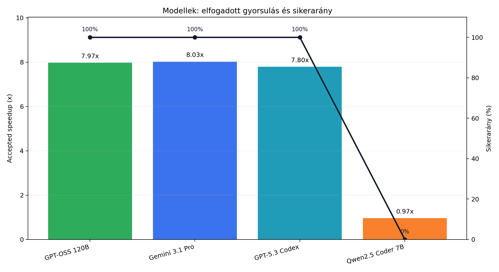
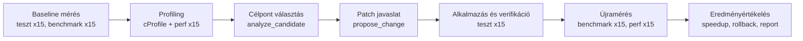
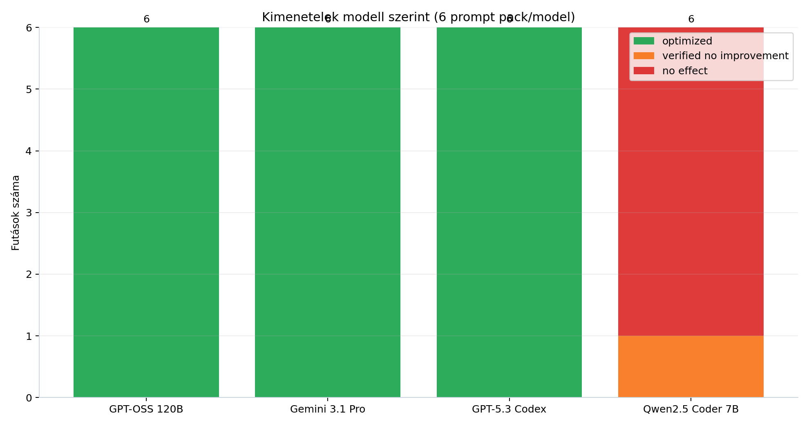
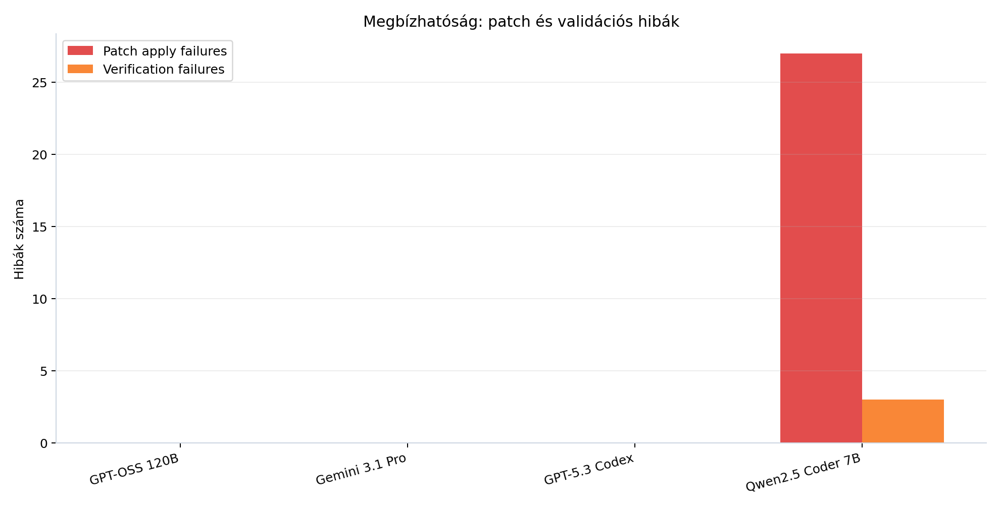
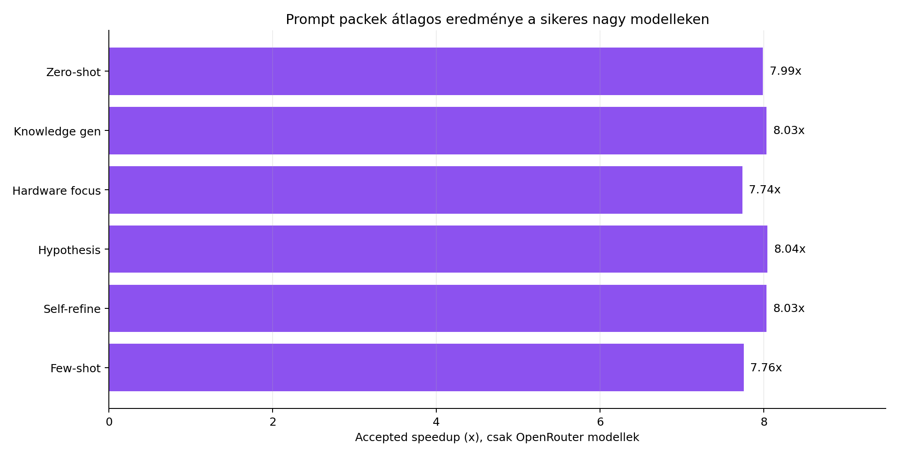
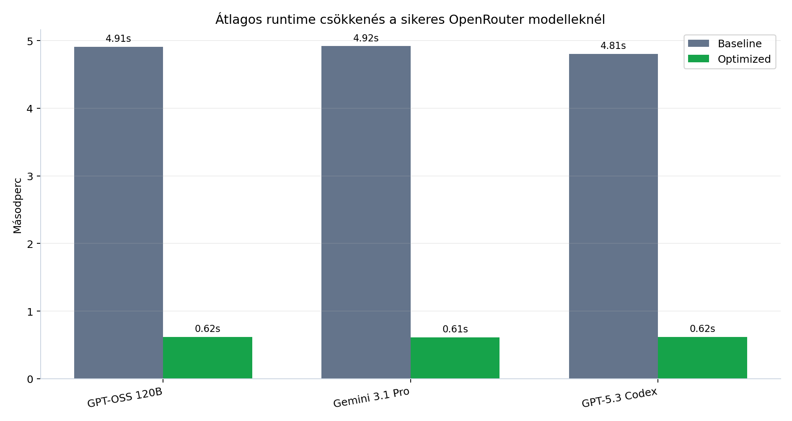
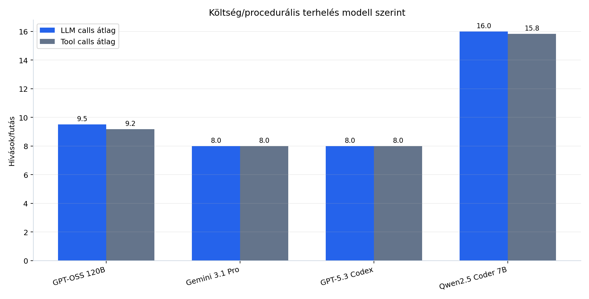

# Tapasztalati összefoglaló az AI-alapú optimalizálási futásról

Ez a dokumentum a `debian-full-heavy` futás eredményeit foglalja össze. A cél az volt, hogy több különböző AI modellt és több promptolási stratégiát össze lehessen hasonlítani ugyanazon optimalizálási feladaton. A vizsgálat fókusza nem csak az volt, hogy mekkora gyorsulás érhető el, hanem az is, hogy az egyes modellek mennyire megbízhatóan választanak célfüggvényt, mennyire stabilan generálnak helyes patchet, mennyi eszközhívást és LLM hívást használnak, illetve mennyire jól működik velük a teljes optimalizáló pipeline.

## Rövid összkép

A teljes futás alapján az optimalizáló rendszer a nagyobb OpenRouter modellekkel kifejezetten jól működött. A három OpenRouteren futtatott modell mind a 6 prompt pack esetén sikeresen optimalizált, tehát ezeknél összesen 18/18 futás lett `optimized`. Ezekben a futásokban az átlagos gyorsulás 7.8x és 8.0x közé esett, ami nagyon erős és stabil eredmény.

A self-hostolt `qwen2.5-coder:7b` ezzel szemben nem tudott érdemi gyorsítást elérni. A 6 futásból 5 `no_effect`, 1 pedig `verified_no_improvement` lett. Ez nem azt jelenti, hogy maga a mérőrendszer hibás volt, hanem inkább azt mutatja, hogy a kisebb, lokálisan futtatott modell a komplexebb patch-generálási és javítási ciklusban nem volt elég stabil. Gyakran felismerte ugyan a jó célterületet, de a generált patch nem ment át a teszteken, vagy nem adott mérhető gyorsulást.

## A kísérlet felépítése

A futás 4 modellt és 6 prompt pack-et tartalmazott, tehát összesen 24 optimizer session futott le. Minden modell minden prompt pack-kel pontosan egyszer futott.

| Dimenzió | Érték |
| --- | --- |
| Projekt | `examples/heavy_compute.py` |
| Teljes optimizer sessionök száma | 24 |
| Modellek száma | 4 |
| Prompt pack-ek száma | 6 |
| Repetition modellenként és prompt pack-enként | 1 |
| Runtime ismétlések száma mérési pontonként | 15 |
| Hardware ismétlések száma mérési pontonként | 15 |
| Sikertelen vagy félbeszakadt optimizer session | 0 |
| Determinisztikus fallback használat | 0 |

A használt modellek:

| Provider | Modell |
| --- | --- |
| OpenRouter | `openai/gpt-oss-120b` |
| OpenRouter | `google/gemini-3.1-pro-preview` |
| OpenRouter | `openai/gpt-5.3-codex` |
| Ollama | `qwen2.5-coder:7b` |

A használt prompt pack-ek:

| Prompt pack | Értelmezés |
| --- | --- |
| `zero_shot` | Közvetlen, példák nélküli optimalizálási feladat |
| `knowledge_gen` | Először tudást és hipotézist épít, majd abból választ optimalizálási irányt |
| `hardware_focus` | Hardveres metrikákra, cache-re, branch missre és locality-re érzékeny stratégia |
| `hypothesis_driven` | Mérési hipotézis alapján választ célpontot és patchet |
| `self_refine` | Saját javaslat ellenőrzése és finomítása hangsúlyosabb |
| `few_shot` | Példák alapján vezeti rá a modellt a kívánt optimalizálási mintára |

## A mérési folyamat

A rendszer minden optimizer sessionben ugyanazt az állapotgépet követte. Először baseline mérést készített, majd profilinggal azonosította a hotspotokat. Ezután a modell célpontot választott, patch-et javasolt, a rendszer alkalmazta és tesztelte, végül újramérte a futási időt és a hardveres metrikákat.

Fontos, hogy a `RUN_REPETITIONS=15` nem 15 teljes optimizer sessiont jelentett, hanem minden mérési ponton 15 ismétlést. Egyetlen modell-prompt kombináció tehát egy optimizer session volt, de azon belül a tesztek, benchmarkok és hardveres mérések átlagolva, 15 futásból számolódtak. Emiatt a kapott runtime értékek sokkal stabilabbak, mintha csak egyetlen futásból származnának.

A teljes mátrix baseline szinten legalább 24 × 15, vagyis 360 tesztismétlést futtatott. A sikeres patch útvonalakon ehhez további verifikációs tesztismétlések járultak hozzá. A benchmark és perf mérések szintén 15 ismétlés átlagából készültek baseline és optimalizált állapotban is.

## Összesített eredmények

| Mutató | Érték |
| --- | ---: |
| Összes optimizer session | 24 |
| Sikeresen optimalizált futás | 18 |
| Verifikált, de nem gyorsabb futás | 1 |
| Hatástalanul zárult futás | 5 |
| Failed futás | 0 |
| Incomplete futás | 0 |
| Átlagos baseline runtime | 4.882 s |
| Átlagos final runtime minden modellen | 1.687 s |
| Átlagos accepted optimized runtime | 0.843 s |
| Átlagos final speedup minden modellen | 6.199x |
| Átlagos accepted speedup | 7.565x |
| Átlagos LLM hívás / session | 10.375 |
| Átlagos tool hívás / session | 10.250 |

Az átlagos final speedup azért alacsonyabb, mint az OpenRouter modellek eredményei, mert ebbe a self-hostolt Qwen futásai is beleszámítanak. Ha csak az OpenRouter modelleket nézzük, akkor a kép lényegesen tisztább: minden futás sikeres volt, és a gyorsulás nagyjából 7.7x és 8.5x között mozgott.

## Modell szerinti tapasztalatok

| Modell | Futások | Sikeres optimalizálás | Átlagos baseline | Átlagos final runtime | Átlagos speedup | Átlagos LLM hívás | Patch hibák | Verifikációs hibák |
| --- | ---: | ---: | ---: | ---: | ---: | ---: | ---: | ---: |
| `google/gemini-3.1-pro-preview` | 6 | 6/6 | 4.918 s | 0.613 s | 8.025x | 8.0 | 0 | 0 |
| `openai/gpt-oss-120b` | 6 | 6/6 | 4.907 s | 0.617 s | 7.974x | 9.5 | 0 | 0 |
| `openai/gpt-5.3-codex` | 6 | 6/6 | 4.806 s | 0.617 s | 7.796x | 8.0 | 0 | 0 |
| `qwen2.5-coder:7b` | 6 | 0/6 | 4.896 s | 4.902 s | 0.999x | 16.0 | 27 | 3 |

### `google/gemini-3.1-pro-preview`

A Gemini 3.1 Pro Preview volt a legerősebb átlagos speedup alapján. Mind a 6 prompt pack esetén sikeresen optimalizált, patch hibája és verifikációs hibája nem volt. Átlagosan 8 LLM hívásból és 8 tool hívásból végig tudta vinni a teljes optimalizálási ciklust, ami azt mutatja, hogy gyorsan és kevés felesleges lépésből megtalálta a jó beavatkozási pontot.

A legjobb egyedi eredménye a `self_refine` prompt pack-kel született: 8.516x gyorsulás, 5.016 másodperces baseline-ról 0.589 másodperces final runtime-ra. Ez alapján a Gemini ebben a rendszerben nem csak pontosan értette a hotspotot, hanem megbízhatóan tudott kis, célzott, tesztelhető patchet készíteni.

### `openai/gpt-oss-120b`

A GPT-OSS 120B szintén nagyon stabilan működött. Mind a 6 futása `optimized` lett, patch hibája nem volt, verifikációs hibája nem volt. Az átlagos gyorsulása 7.974x volt, ami gyakorlatilag a Gemini eredményével azonos nagyságrend. A különbség inkább a folyamatköltségben látszott: átlagosan 9.5 LLM hívást és 9.17 tool hívást használt, tehát valamivel több lépésből jutott ugyanoda.

A legjobb futása a `hypothesis_driven` prompt pack-kel történt: 8.436x gyorsulás. A modell erőssége az volt, hogy jól használta a mérési eredményeket és a profilingból származó hotspot információt. A gyengébb oldala nem minőségi, hanem hatékonysági jellegű: néha több inspect vagy megerősítő lépést igényelt, mint a Gemini vagy a GPT-5.3 Codex.

### `openai/gpt-5.3-codex`

A GPT-5.3 Codex szintén 6/6 sikeres optimalizálást ért el. Átlagos gyorsulása 7.796x volt, ami egy kicsit alacsonyabb, mint a Gemini és a GPT-OSS átlaga, de még mindig nagyon erős. A futási folyamata kifejezetten tiszta volt: 8 átlagos LLM hívás, 8 átlagos tool hívás, nulla patch hiba és nulla verifikációs hiba.

A modell viselkedése mérnöki szempontból nagyon jó: stabil, rövid úton jut eredményre, és nem pazarló a tool használatban. Ha nem csak a maximális speedupot, hanem a megbízhatóságot és költséghatékonyságot is figyelembe vesszük, akkor ez az egyik legjobb jelölt a további futásokhoz.

### `qwen2.5-coder:7b`

A lokálisan, Ollamán futó Qwen 2.5 Coder 7B volt a futás egyértelműen gyengébb szereplője. A 6 futásból egyik sem lett ténylegesen gyorsabb optimalizáció. Öt futás `no_effect`, egy pedig `verified_no_improvement` lett. Az átlagos final speedup 0.999x, vagyis gyakorlatilag nincs mérhető javulás.

Ez különösen érdekes, mert a modell gyakran nem teljesen rossz célpontot választott: több futásban a `segmented_prefix_sums_slow` környékére jutott, ami valóban a fő hotspot volt. A probléma inkább a patch minőségében jelentkezett. Összesen 27 patch alkalmazási hiba és 3 verifikációs hiba keletkezett, miközben átlagosan 16 LLM hívást használt sessionönként. Ez azt mutatja, hogy a kisebb modell sokszor eljutott a helyes irány közelébe, de nem tudta stabil, teszteken átmenő, teljesítményt javító kóddá formálni az ötletet.

## Prompt pack szerinti tapasztalatok

A prompt pack-ek összehasonlításánál két dolgot érdemes külön kezelni. Ha minden modellt együtt nézünk, akkor a Qwen gyenge szereplése minden prompt pack átlagát lefelé húzza. Ha viszont csak az OpenRouter modelleket nézzük, akkor mindegyik prompt pack 3/3 sikeres optimalizálást ért el, és a különbségek már inkább finomhangolási jellegűek.

| Prompt pack | OpenRouter sikerarány | OpenRouter átlagos speedup | Megfigyelés |
| --- | ---: | ---: | --- |
| `hypothesis_driven` | 3/3 | 8.043x | A legjobb átlagos OpenRouter speedup; jól illik mérésalapú optimalizáláshoz |
| `knowledge_gen` | 3/3 | 8.032x | Erős, stabil stratégia; jó előzetes magyarázatból vezet le beavatkozást |
| `self_refine` | 3/3 | 8.031x | Nagyon erős a nagy modelleknél, Gemini ezzel érte el a legjobb egyedi eredményt |
| `zero_shot` | 3/3 | 7.991x | Meglepően erős baseline; a feladat domináns hotspotja miatt sok információ nélkül is működött |
| `few_shot` | 3/3 | 7.756x | Stabil, de ebben a benchmarkban nem hozott extra előnyt |
| `hardware_focus` | 3/3 | 7.738x | Hasznos, de a fő nyereség algoritmikus volt, nem cache-szintű mikrotuning |

A prompt pack-ek alapján az látszik, hogy ennél a konkrét benchmarknál nem a promptstratégia finomságai döntötték el a sikert, hanem az, hogy a modell felismeri-e a domináns algoritmikus hotspotot és képes-e helyes patchet írni. A promptstratégiák közti különbség a nagy modelleknél kisebb volt, mert mindhárom OpenRouter modell ugyanarra a fő optimalizálási mintára jutott.

Ennek ellenére a `hypothesis_driven`, `knowledge_gen` és `self_refine` prompt pack-ek tűnnek a legerősebbnek a további nagy futásokhoz. Ezek jól passzolnak a program mérésalapú működéséhez: nem csak kódot kérnek a modelltől, hanem explicit módon összekötik a profilingot, a hipotézist, a patch indoklását és a verifikációs visszacsatolást.

## Miért lett minden erős modellnél kb. 8x gyorsulás?

Azért hasonló a gyorsulás a nagy modelleknél, mert a benchmarkban volt egy nagyon domináns optimalizálási lehetőség. A cProfile hotspotok alapján a `segmented_prefix_sums_slow` a futási idő körülbelül 84-87%-át vitte el. Ez a függvény eredetileg kvadratikus jellegű munkát végzett, vagyis ismételten újraszámolt olyan részösszegeket, amelyeket egy futó összeges dictionary-vel lineáris időben is lehet kezelni.

A nagy modellek szinte mind ugyanazt a lényegi átalakítást találták meg: a drága, ismétlődő számolást lecserélték egy O(n) futó összeges megoldásra. Mivel ugyanazt a domináns problémát oldották meg, a végső runtime is hasonló tartományba esett: nagyjából 0.59-0.70 másodperc közé.

Ez a viselkedés Amdahl-törvény szempontból is érthető. Ha a program futási idejének túlnyomó részét egyetlen javítható hotspot adja, akkor annak kijavítása után a maradék programrész lesz a korlát. Emiatt a további promptolási vagy modellkülönbségek már csak kisebb eltéréseket okoznak.

## Tool- és LLM-használat

A tool- és LLM-hívások száma jól mutatja, mennyire magabiztosan haladt végig egy modell az állapotgépen. A Gemini és a GPT-5.3 Codex átlagosan 8 LLM hívásból végzett. A GPT-OSS 120B valamivel több, átlagosan 9.5 hívást igényelt, de hibamentesen zárt. A Qwen átlagosan 16 LLM hívásig ment el, vagyis elérte a megengedett keret végét, miközben érdemi optimalizációt nem tudott stabilan létrehozni.

Ez gyakorlati szempontból fontos tapasztalat. A nagyobb modellek drágábbak lehetnek egyetlen hívásra vetítve, de kevesebb sikertelen próbálkozást, kevesebb hibás patchet és sokkal jobb végső eredményt adtak. A kisebb self-hostolt modell olcsóbbnak tűnik, de a sok sikertelen kör és a nullához közeli speedup miatt ebben a feladatban nem volt hatékony alternatíva.

## Hardveres metrikák és cache értelmezése

A hardveres metrikák közül a cache hit/miss, L1 hit/miss és branch miss adatok rendelkezésre álltak. Az LLC adatok viszont nem: a riport szerint az `LLC-loads` és `LLC-load-misses` counterek nem támogatottak ezen a gépen vagy ebben a futtatási környezetben. Ez nem a Python kód és nem az optimalizáló program hibája, hanem `perf`/kernel/hardver/virtualizációs korlát.

Az átlagos cache hit rate baseline állapotban 97.29%, optimalizált állapotban 96.02% volt. Első ránézésre ez úgy tűnhet, mintha romlott volna a cache-viselkedés, de ezt óvatosan kell értelmezni. Az optimalizált kód sokkal kevesebb teljes munkát végez, ezért az abszolút cache referencia- és miss-számok jelentősen megváltoznak. A ráta önmagában nem mindig mutatja meg a teljes képet. Ebben a futásban a lényegi eredmény az, hogy a runtime drasztikusan csökkent.

A branch miss rate szintén magasabb lett arányként az optimalizált állapotban, de ez sem jelenti automatikusan azt, hogy a program rosszabb lett. A program teljes futásideje körülbelül nyolcadára esett vissza, ezért a relatív hardveres arányok más nevezőn számolódnak. Ebből az következik, hogy a dolgozatban vagy prezentációban érdemes a cache metrikákat kiegészítő indikátorként kezelni, nem elsődleges sikerkritériumként. Az elsődleges sikerkritérium ebben az esetben a verifikált tesztek mellett mért runtime speedup.

## Legjobb egyedi futások

| Rang | Modell | Prompt pack | Baseline | Final runtime | Speedup |
| ---: | --- | --- | ---: | ---: | ---: |
| 1 | `google/gemini-3.1-pro-preview` | `self_refine` | 5.016 s | 0.589 s | 8.516x |
| 2 | `openai/gpt-oss-120b` | `hypothesis_driven` | 5.016 s | 0.595 s | 8.436x |
| 3 | `openai/gpt-oss-120b` | `knowledge_gen` | 4.861 s | 0.589 s | 8.258x |
| 4 | `google/gemini-3.1-pro-preview` | `zero_shot` | 5.014 s | 0.610 s | 8.225x |
| 5 | `openai/gpt-oss-120b` | `self_refine` | 4.912 s | 0.604 s | 8.135x |
| 6 | `openai/gpt-5.3-codex` | `knowledge_gen` | 4.833 s | 0.596 s | 8.110x |

## Mit mutat ez a programról?

A futás alapján a rendszer alkalmas arra, hogy AI modelleket és promptolási stratégiákat mérhető módon hasonlítson össze kódoptimalizálási feladaton. A pipeline nem csak azt nézi, hogy a modell mond-e valamit, hanem teljes kört zár: baseline mérés, profiling, patch, teszt, újramérés, riport és diagramok. Ez különösen fontos, mert az AI által javasolt optimalizációk önmagukban nem megbízhatóak. A rendszer értéke abban van, hogy a javaslatokat mérhető és visszaellenőrzött folyamatba kényszeríti.

A 0 failed és 0 incomplete optimizer session azt mutatja, hogy a futtatási infrastruktúra stabil volt. A sikertelen Qwen próbálkozások nem állították meg a teljes mátrixot, hanem mérhető `no_effect` vagy `verified_no_improvement` eredményként jelentek meg. Ez jó tulajdonság, mert egy nagy modell- és promptösszehasonlításnál elkerülhetetlen, hogy egyes kombinációk rosszabbul teljesítsenek.

## Mit mutat ez az AI modellekről?

A nagyobb modellek előnye ebben a feladatban nem az volt, hogy sokkal kreatívabb megoldást találtak, hanem az, hogy stabilan és hibamentesen végig tudták vinni ugyanazt a jó mérnöki döntést. A benchmark domináns hotspotja miatt a fő felismerés viszonylag egyértelmű volt egy erős modellnek: a kvadratikus prefix számítást lineáris futó összeges megoldásra kell cserélni.

Ettől még a különbségek fontosak. A Gemini és a GPT-5.3 Codex nagyon kevés lépésből zárt, a GPT-OSS 120B szintén megbízható volt, de kicsit több döntési és tool lépést használt. A Qwen 7B megmutatta, hogy a kisebb modellek esetén a célpont felismerése önmagában nem elég. A patch szintaktikai és szemantikai minősége, a teszteken való átmenés és a tényleges gyorsulás legalább ilyen fontos.

## Mit mutat ez a promptolási stratégiákról?

A promptolási stratégiák közül a mérésalapú, explicit gondolkodási keretet adó pack-ek voltak a legérdekesebbek. A `hypothesis_driven`, `knowledge_gen` és `self_refine` jól illeszkednek ehhez a rendszerhez, mert a program eleve sok strukturált információt ad a modellnek: runtime átlagokat, hardware digestet, cProfile hotspotokat, állapotgépet, engedélyezett toolokat és korábbi eredményeket.

Ebben a konkrét benchmarkban a `zero_shot` is erős volt, mert a domináns hotspot nagyon nagy volt. Ez azonban nem jelenti azt, hogy általánosan a zero-shot lenne a legjobb. Egy kevésbé egyértelmű, több kisebb hotspotból álló programnál valószínűleg nagyobb előnye lenne azoknak a stratégiáknak, amelyek explicit hipotéziseket, önellenőrzést vagy lépésenkénti bontást használnak.

## Korlátok és óvatosságok

A futás csak egy repetitiont használt modell-prompt kombinációnként. A mérési pontok 15 ismétlésből átlagolódtak, tehát a runtime adatok stabilak, de a modellviselkedés statisztikai varianciáját nem méri teljesen. Ha publikációs vagy erősebb következtetés kell, érdemes legalább 2-3 optimizer session repetitiont futtatni a legfontosabb modell-prompt kombinációkra.

A benchmarkban volt egy nagyon domináns hotspot. Ez jó demonstrációs feladat, mert látványos gyorsulást ad, de emiatt a nagy modellek közti különbség részben elfedődik. A következő szint az lenne, hogy többféle projektet vagy több, eltérő szerkezetű benchmarkot futtatunk: egy algoritmikusat, egy cache/locality fókuszút, egy adatstruktúra-fókuszút és egy nehezebben optimalizálható, több kisebb hotspotot tartalmazó programot.

Az LLC metrikák hiányoznak, mert a futtatási környezet nem támogatja ezeket a `perf` countereket. Ez a cache-elemzés egyik korlátja, de a fő runtime következtetést nem érvényteleníti.

## Végső következtetés

A futás alapján a program eléri a kitűzött célt: képes AI modelleket és promptolási stratégiákat összehasonlítani mérhető, reprodukálható, tesztekkel ellenőrzött optimalizálási folyamatban. A legerősebb eredményt a nagy OpenRouter modellek adták, különösen a Gemini 3.1 Pro Preview, a GPT-OSS 120B és a GPT-5.3 Codex. Ezek minden prompt pack-kel sikeresen optimalizáltak, és átlagosan körülbelül 8x gyorsulást értek el.

A self-hostolt Qwen 2.5 Coder 7B ezzel szemben ebben a konfigurációban nem volt elég stabil. Ez önmagában hasznos tapasztalat: az AI-alapú optimalizálásnál nem elég, hogy egy modell olcsó vagy lokálisan futtatható, mert a patch megbízhatósága és a verifikált teljesítményjavulás döntő.

A legfontosabb tanulság, hogy az AI akkor tud valódi mérnöki értéket adni, ha nem önmagában generál kódot, hanem egy mérésvezérelt rendszer részeként működik. Ebben a rendszerben a modell javasol, a program mér, tesztel, visszacsatol és objektíven eldönti, hogy a változtatás valóban javított-e. Ez az a szintlépés, ami túlmutat a sima promptoláson: az AI nem csak választ ad, hanem egy automatizált optimalizálási ciklus részeként mérhetően jobb programot tud előállítani.
